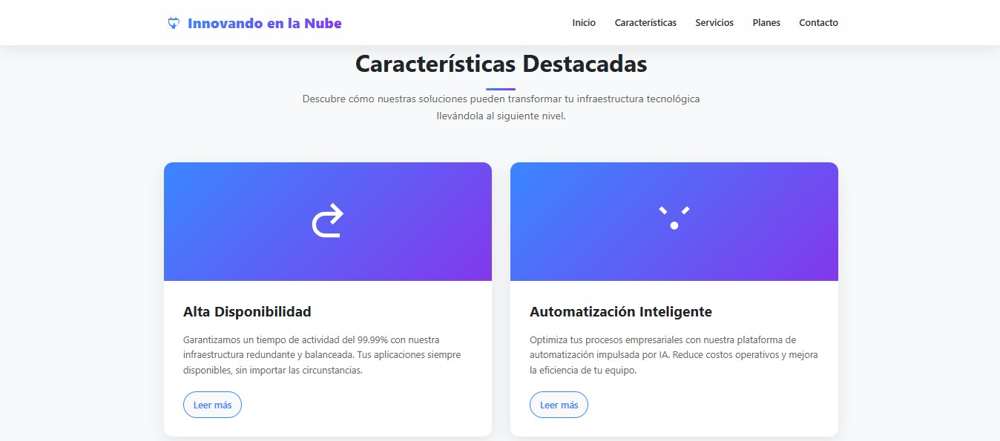
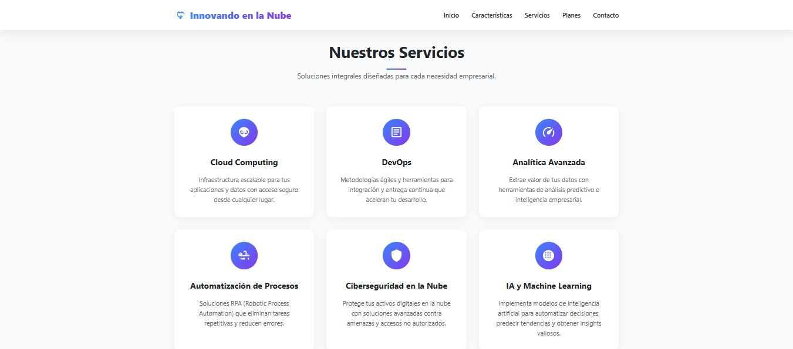

### Santiago José Barraza Sinning

## Plataformas II

### GitHub code:

https://github.com/santiagobarrazas/devopsworks-website

# DevOpsWorks Website Helm Chart

## Overview
This repository contains a Helm chart for deploying the DevOpsWorks website—a static landing page showcasing services such as DevOps consulting, support, machine learning, and cybersecurity. The original chart was sourced from the devops-works/helm-charts repository. However, due to the absence of the expected Docker image (`devopsworks-website`), a custom implementation was necessary.

## Project Structure
* `templates/`: Contains Kubernetes manifest templates for Deployment, Service, Ingress, etc.
* `values.yaml`: Defines default configuration values for the chart.
* `web/`: Holds the static website files (HTML, CSS, JS, images).
* `.helmignore`: Specifies files and directories to ignore during packaging.

## Implementation Details

### 1. Initial Setup
The contents of the `devopsworks-website` chart were copied into this repository to serve as the foundation for customization and deployment.

### 2. Static Website Creation
A static website was developed and placed within the `web/` directory. This site serves as the landing page for DevOpsWorks, detailing various services offered. The decision to create a custom site stemmed from the unavailability of the original Docker image.





### 3. Dockerization
A `Dockerfile` was created to containerize the static website using Nginx:

```dockerfile
FROM nginx:alpine
COPY index.html /usr/share/nginx/html/
COPY styles.css /usr/share/nginx/html/
COPY scripts.js /usr/share/nginx/html/
COPY img/ /usr/share/nginx/html/img/
EXPOSE 80
```

The image was built and pushed to Docker Hub under the repository `sjbs0212/devops-website`.

### 4. Helm Chart Adjustments

#### a. `.helmignore` Update
To prevent the `web/` directory from being packaged with the chart (due to size constraints), it was added to `.helmignore`:

```
.idea/
*.tmproj
.vscode/
web/
```

#### b. `values.yaml` Modification
The `image` section was updated to reference the newly built Docker image:

```yaml
image:
  repository: sjbs0212/devops-website
  pullPolicy: IfNotPresent
  tag: "v1"
```

### 5. Ingress Configuration

#### a. `ingress.yaml` Template Update
The Ingress template was modified to correctly utilize the `path` and `pathType` values:

```yaml
http:
  paths:
    {{- range .paths }}
    - path: {{ .path }}
      pathType: {{ .pathType }}
    {{- end }}
```

#### b. `values.yaml` Ingress Settings
Ingress was enabled and configured to route traffic to the service:

```yaml
ingress:
  enabled: true
  annotations:
    kubernetes.io/ingress.class: "nginx"
  hosts:
    - host: "localhost"
      paths:
        - path: /
          pathType: Prefix
  tls: []
```

### 6. Liveness Probe Adjustment
The liveness probe in `deployment.yaml` was updated to reflect the root path of the static site:

```yaml
livenessProbe:
  httpGet:
    path: /
    port: http
```

This change ensures Kubernetes can accurately assess the health of the Nginx container serving the static content.

## Deployment Instructions
To deploy the DevOpsWorks website using this Helm chart:

1. Add the Helm repository (if applicable) or use the local chart.
2. Install the chart:
   ```bash
   helm install devopsworks-website ./path-to-chart
   ```
3. Ensure that the Ingress controller is set up and configured to handle the specified host (`localhost` in this case).

## Conclusion
This customized Helm chart facilitates the deployment of a static DevOpsWorks landing page using Nginx. Adjustments were made to accommodate the absence of the original Docker image, including the creation of a custom static site, Dockerization, and necessary Helm chart modifications to ensure seamless deployment and operation within a Kubernetes environment.
